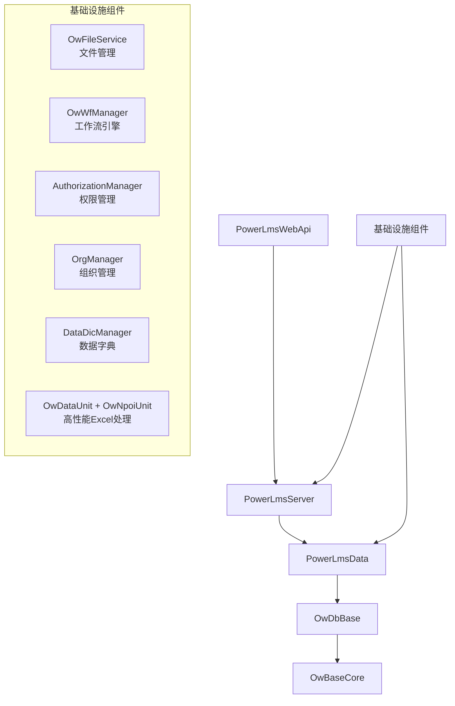

<!--
PowerLms Metadata
workspace: C:\Users\zc-home\source\ourworldcn\PowerLms\
framework: .NET 6
copilot_prompt: .github\prompts\me.prompt.md
copilot_reference: #prompt:'.github\prompts\me.prompt.md'
architecture: API→Server→Data→OwDbBase→OwBaseCore
code_lines: 317000
team: 3
projects: [PowerLmsWebApi, PowerLmsServer, PowerLmsData, OwDbBase, OwBaseCore]
infrastructure: [OwFileService, OwWfManager, AuthorizationManager, OrgManager, DataDicManager, OwDataUnit, OwNpoiUnit]
deprecated: [NpoiManager]
workspace_structure: 分层架构(API-业务-数据)，基础设施完备，基于Bak目录的核心组件依赖
-->

# PowerLms
货运物流业务管理系统，基于 .NET 6 构建的企业级平台

[](https://dotnet.microsoft.com/)
[](https://docs.microsoft.com/en-us/ef/)
[](README.md)
[](README.md)

## ⚠️ 优先级约束

### 🌏 语言使用规范
**使用简体中文回答问题** - 回答我的问题必须使用简体中文，技术术语可保留英文原文


### 🛡️ 数据库迁移安全约束
**禁止自动创建数据迁移文件** - 所有数据库变更必须手动规划，确保生产环境稳定性

## 📋 GitHub Copilot 智能体配置

**重要**: 本项目已配置GitHub Copilot智能体开发规范，确保代码生成符合企业级标准。

### 智能体功能
- 强制使用基础设施组件（OwFileService、OwWfManager、AuthorizationManager）
- 严格遵循代码风格要求
- 确保权限验证和多租户数据隔离
- 优先使用OwDataUnit + OwNpoiUnit高性能Excel处理方案
- 禁止使用废弃的NpoiManager组件

## 🏗️ 系统架构概览

**PowerLms** 是一个专业的货运物流业务管理系统，覆盖海运、空运、陆运、铁路等全流程管理，具备完整的企业级基础设施。

### 项目结构

```
PowerLms解决方案
├── PowerLmsWebApi/          # API接口层 (84文件)
│   ├── Controllers/         # RESTful API控制器
│   ├── 权限认证体系          # JWT + 细粒度权限控制
│   └── Swagger文档          # 完整API文档支持
├── PowerLmsServer/          # 业务逻辑层 (40文件)  
│   ├── Managers/            # 业务管理器(DataDicManager等)
│   ├── 工作流引擎           # OwWfManager企业级审批流程
│   └── 文件管理服务          # OwFileService通用文件系统
├── PowerLmsData/           # 数据访问层 (274文件)
│   ├── 实体模型            # 复杂物流业务实体关系
│   ├── DbContext           # PowerLmsUserDbContext主数据库上下文
│   └── 200+迁移文件        # 长期演进的数据库结构变更
└── 基础设施组件 (Bak目录)
    ├── OwDbBase/           # 数据库基础框架
    │   ├── OwDbContext     # 企业级数据库上下文基类
    │   └── 高性能组件      # OwDataUnit + OwNpoiUnit
    └── OwBaseCore/         # 核心基础组件
```

### 依赖关系图



### 核心特性
- 🚢 **物流全流程**: 支持海运、空运、陆运、铁路等多运输方式
- 🏗️ **企业级架构**: RESTful API、前后端分离、微服务就绪  
- 🔐 **细粒度权限**: 基于角色和组织的访问控制，支持多租户隔离
- 💰 **财务集成**: 金蝶、诺诺等外部系统对接，自动生成凭证
- ⚡ **基础设施完备**: 工作流引擎、文件管理、权限系统企业级就绪
- 🚀 **高性能数据处理**: OwDataUnit + OwNpoiUnit 优化的Excel批量处理方案

## 🏗️ 基础设施组件

> **重要**: 新功能开发请优先复用现有基础设施！

### 核心组件清单
| 组件 | 服务类 | 所在项目 | 功能描述 |
|------|--------|----------|----------|
| **文件管理** | `OwFileService` | PowerLmsServer | 文件存储、权限控制、元数据管理 |
| **工作流引擎** | `OwWfManager` | PowerLmsServer | 多级审批、动态审批人、状态跟踪 |
| **权限管理** | `AuthorizationManager` | PowerLmsServer | 细粒度权限、多租户隔离 |
| **组织管理** | `OrgManager` | PowerLmsServer | 商户、公司、部门管理 |
| **数据字典** | `DataDicManager` | PowerLmsServer | 系统配置、枚举管理 |
| **消息系统** | `OwMessageManager` | PowerLmsServer | 系统内消息管理、通知推送 |
| **Excel处理** | `OwDataUnit` + `OwNpoiUnit` | OwDbBase | 高性能Excel导入导出、批量数据处理 |

### 技术特性
- **依赖注入**: 全面使用 `[OwAutoInjection]` 自动注入
- **配置监控**: 支持运行时配置更新 (`IOptionsMonitor<T>`)
- **数据库工厂**: 使用 `IDbContextFactory<PowerLmsUserDbContext>` 模式
- **高性能**: OwDataUnit直接字符串数组处理，跳过JSON序列化
- **企业级**: 完整的日志记录、异常处理、权限验证

### 使用指南
```csharp
// 文件操作 → 使用 OwFileService
// 审批流程 → 使用 OwWfManager  
// 权限验证 → 使用 AuthorizationManager
// Excel处理 → 使用 OwDataUnit + OwNpoiUnit（替代废弃的NpoiManager）
// 组织管理 → 使用 OrgManager
// 系统配置 → 使用 DataDicManager
// 消息通知 → 使用 OwMessageManager
```

## 业务模块

### 核心业务
- **客户资料**: 客户信息、联系人、开票信息、装货地址、海关检疫状态
- **业务单据**: 海运/空运进出口、工作号管理、费用核算  
- **财务管理**: 结算单、发票、费用方案、凭证生成、AR/AP财务编码对接
- **系统管理**: 用户权限、组织架构、数据字典、工作流
- **数据处理**: 高性能Excel导入导出、批量数据同步

### 外部集成
- **金蝶接口**: 财务凭证数据导出，支持AR/AP编码精确匹配
- **诺诺发票**: 电子发票开具集成，完整回调处理
- **多租户**: 支持商户、公司、部门多级隔离

## 快速开始

### 环境要求
- .NET 6.0+
- SQL Server 2016+
- Visual Studio 2022 / VS Code

### 项目启动步骤
```bash
# 1. 克隆代码
git clone https://github.com/ourworldcn/PowerLms.git

# 2. 配置数据库连接
# 编辑 PowerLmsWebApi/appsettings.json
# 设置 PowerLmsUserDbContext 连接字符串

# 3. 还原NuGet包
dotnet restore

# 4. 启动WebAPI项目
dotnet run --project PowerLmsWebApi

# 5. 访问 API 文档
https://localhost:5001/swagger
```

### 数据库初始化
```bash
# 注意：PowerLms禁止自动迁移，需要手动执行
# 1. 在SQL Server中创建空数据库
# 2. 运行PowerLmsData中的迁移文件
# 3. 导入SystemResources/InitData中的初始化数据
```

## 开发规范

### 设计原则
1. **基础设施优先**: 优先复用现有组件，避免重复开发
2. **稳定第一**: 渐进式修改，保持向后兼容
3. **分层架构**: 严格遵循 API → 业务 → 数据 层次结构
4. **权限控制**: 所有业务操作需要权限验证
5. **性能优先**: 使用高性能的OwDataUnit处理大批量数据

### 关键约束
- **禁止自动数据迁移**: 所有数据库变更需手动规划
- **必须权限验证**: 重要操作需要 `AuthorizationManager.Demand()`
- **多租户隔离**: 数据查询需要 `OrgId` 过滤
- **异常处理**: 统一使用 `OwHelper.SetLastErrorAndMessage()`
- **Excel处理标准**: 使用OwDataUnit + OwNpoiUnit，避免使用废弃的NpoiManager

### 基础设施使用规范
```csharp
// ✅ 推荐：复用基础设施组件
public class BusinessService
{
    private readonly OwFileService _fileService;
    private readonly OwWfManager _workflowManager;
    private readonly AuthorizationManager _authManager;
    
    // 文件上传
    public async Task<FileInfo> UploadFileAsync(IFormFile file)
    {
        // 使用企业级文件管理系统
        return await _fileService.SaveFileAsync(file, context);
    }
    
    // 审批流程
    public async Task<bool> StartApprovalAsync(Guid entityId)
    {
        // 使用工作流引擎
        return await _workflowManager.StartWorkflowAsync(entityId, workflowTemplateId);
    }
}

// ❌ 禁止：重复造轮子
public class BadService
{
    // 不要自己实现文件管理
    // 不要自己实现审批流程
    // 不要自己实现权限控制
}
```

## 🚀 最新技术改进（2024年）

### Excel处理架构重构
- **废弃组件**: `NpoiManager` 类已完全废弃，标记为 `[Obsolete]`
- **新架构**: `OwDataUnit` + `OwNpoiUnit` 高性能组合
- **性能提升**: 
  - 跳过JSON序列化，直接字符串数组处理
  - 支持批量插入优化，自动处理重复数据
  - 使用PooledList减少内存分配

#### 最佳实践示例
```csharp
// ❌ 废弃方式（NpoiManager）
_npoiManager.WriteToDb(sheet, context, dbSet);

// ✅ 推荐方式（OwDataUnit + OwNpoiUnit）
var count = OwDataUnit.BulkInsertFromExcelWithStringList<T>(
    sheet, dbContext, ignoreExisting: true, logger, "操作描述");

// ✅ 高性能读取方式
using var allRows = OwNpoiUnit.GetStringList(sheet, out var headers);
var entities = OwNpoiUnit.GetSheet<T>(sheet);
```

### 基础设施完备性增强
- ✅ **消息系统**: OwMessageManager支持系统内消息管理
- ✅ **配置监控**: 支持运行时配置更新和变更通知
- ✅ **数据库工厂**: 高并发场景下的DbContext管理优化
- ✅ **自动清理**: 定时清理过期消息，支持配置化管理

## 当前开发状态

### 最新进展
- ✅ **基础设施完备**: 文件管理、工作流、权限系统企业级就绪
- ✅ **OA费用申请**: 完整的申请→审批→结算→凭证流程
- ✅ **外部集成**: 金蝶、诺诺接口集成完成
- ✅ **Excel处理重构**: OwDataUnit + OwNpoiUnit高性能方案
- ✅ **财务编码优化**: AR/AP编码精确对接金蝶系统
- ✅ **智能体集成**: GitHub Copilot 提示词配置完成
- ✅ **消息系统**: OwMessageManager企业级消息管理

### 技术债务处理
- ✅ NpoiManager类已废弃，完成无用引用清理
- ✅ Excel处理性能优化，统一使用新架构
- ✅ GitHub Copilot 智能体开发规范建立
- ✅ 基础设施组件文档化和使用规范建立
- ⚠️ 明细表币种/汇率字段需要移除
- ⚠️ 部分legacy代码需要重构
- ⚠️ 单元测试覆盖率需要提升

### 业务功能增强
- ✅ 海关检疫业务支持（`IsCustomsQuarantine`）
- ✅ 财务编码双轨制（AR客户编码 + AP供应商编码）
- ✅ 诺诺发票完整生命周期管理
- ✅ 航线数据高性能批量导入
- ✅ 系统内消息推送和管理

## 系统规模与团队

### 规模指标
- **代码规模**: 31.7万行C#代码，398个文件
- **数据迁移**: 200+个迁移文件，体现系统长期演进
- **权限节点**: 数百个细粒度权限控制点
- **开发团队**: 3人精英小团队，人均产出10.6万行代码

### 技术栈
- **.NET Framework**: .NET 6.0
- **数据访问**: Entity Framework Core 6.0
- **数据库**: SQL Server (支持2016+)
- **API框架**: ASP.NET Core 6.0
- **前端接口**: RESTful API + Swagger文档
- **依赖注入**: Microsoft.Extensions.DependencyInjection
- **日志系统**: Microsoft.Extensions.Logging
- **文档生成**: XML Documentation + Swagger

## 贡献指南

### 开发流程
```bash
git checkout -b feature/新功能描述
# 开发完成后
git commit -m 'feat: 添加新功能'
git push origin feature/新功能描述
# 提交 Pull Request
```

### 审查要点
- 是否复用了现有基础设施组件
- 是否遵循了权限验证要求
- 是否保持了数据库向后兼容
- 是否使用了推荐的Excel处理方案
- 是否符合GitHub Copilot智能体提示词要求
- 是否编写了必要的单元测试

### Excel处理规范
```csharp
// ✅ 推荐：使用新的高性能方案
OwDataUnit.BulkInsertFromExcelWithStringList<Entity>()
OwNpoiUnit.GetSheet<Entity>()
OwNpoiUnit.GetStringList()

// ❌ 禁止：使用废弃的NpoiManager
NpoiManager.WriteToDb() // 已标记 [Obsolete]
NpoiManager.GetJson()   // 已标记 [Obsolete]
```

### 基础设施优先开发清单
```markdown
✅ 新功能开发检查清单
□ 文件操作需求 → 优先使用 OwFileService
□ 审批流程需求 → 优先使用 OwWfManager
□ 权限控制需求 → 优先使用 AuthorizationManager
□ 组织管理需求 → 优先使用 OrgManager
□ 系统配置需求 → 优先使用 DataDicManager
□ 消息通知需求 → 优先使用 OwMessageManager
□ Excel处理需求 → 优先使用 OwDataUnit + OwNpoiUnit
□ 避免重复造轮子，确保系统一致性
```

---

**PowerLms** - 专业的货运物流业务管理系统  
*由3人精英团队开发，31.7万行高质量代码，企业级基础设施完备*  
*2024年技术架构优化：高性能Excel处理，财务系统深度集成，GitHub Copilot智能体集成*

**架构亮点**: API→Server→Data→OwDbBase→OwBaseCore 清晰分层，基础设施组件完备复用
